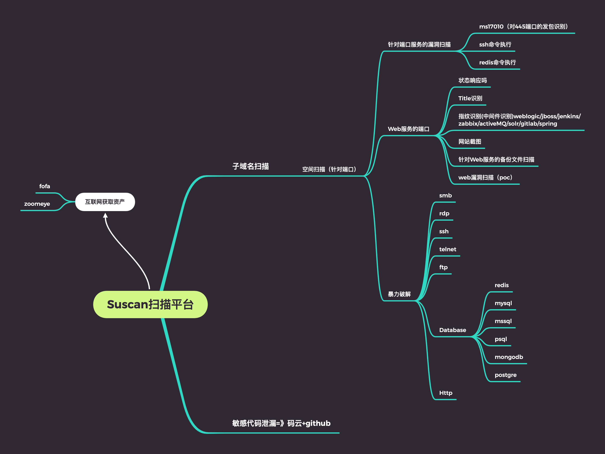

## 🌀 Suscan 
<a href="https://github.com/tangxiaofeng7/Suscan"></a>
<a href="hhttps://github.com/tangxiaofeng7/Suscan"></a>
<a href="https://github.com/tangxiaofeng7/Suscan"></a>

  
#  👻 Introduce
一款综合扫描平台，方便一键自动化、全方位漏扫扫描。

## 🏃🏼 Design


## 😊 Run
安装docker与docker-compose
```
curl -fsSL [https://get.docker.com/](https://get.docker.com/) | sh  

systemctl restart docker  

systemctl enable docker  

wget [https://github.com/docker/compose/releases/download/1.29.2/docker-compose-Linux-x86_64](https://github.com/docker/compose/releases/download/1.29.2/docker-compose-Linux-x86_64)

sudo cp docker-compose-Linux-x86_64 /usr/bin/docker-compose

sudo chmod 777 /usr/bin/docker-compose
```

docker-compose启动
```
docker-compose up -d
```

## 😏 Api
添加扫描资产：

curl --location --request POST 'http://localhost:18000/api/v1/assets' \
--form 'assets="txf.com
txf1.com
txf2.com"'

修改扫描配置：port参数：要扫描的端口 cmd参数：同时启动nmap的个数（1-10）timetemplat参数：nmap扫描速率（1-5）

curl --location --request POST 'http://ip:18000/api/v1/scansetting' \
--form 'thread="5000"' \
--form 'port="1-65535"' \
--form 'cmd="7"' \
--form 'timetemplate="4"'

开启扫描：

curl --location --request GET 'http://ip:18000/api/v1/scan'

获取扫描结果中的高危端口：

curl --location --request GET 'http://ip:18000/api/v1/getVulPort'

获取扫描结果中的高危协议：

curl --location --request GET 'http://ip:18000/api/v1/getVulPro'